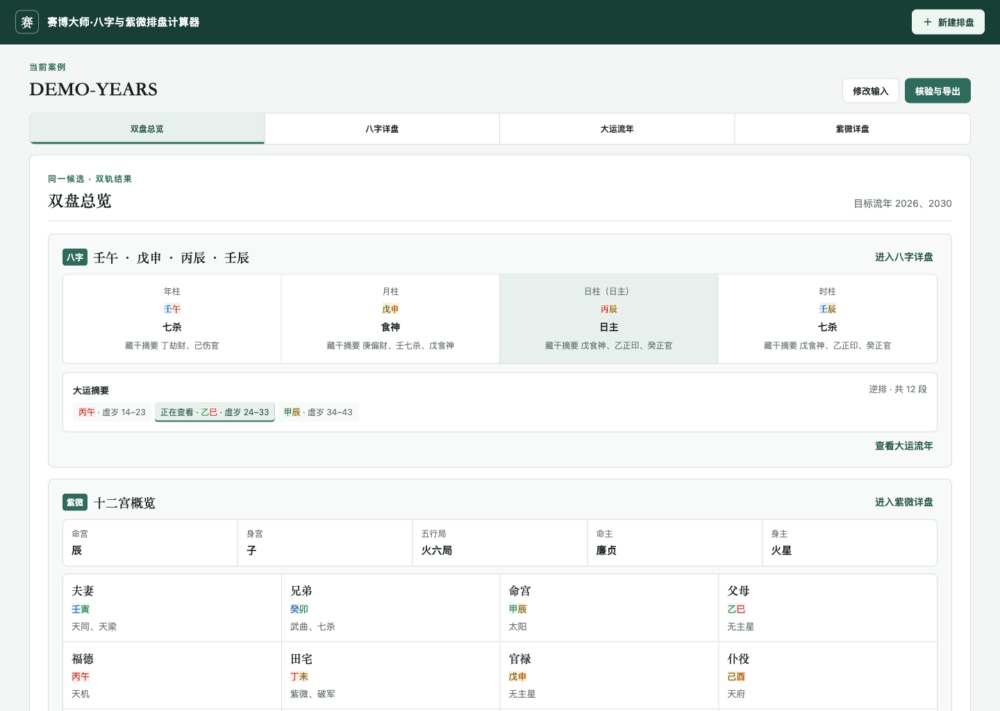
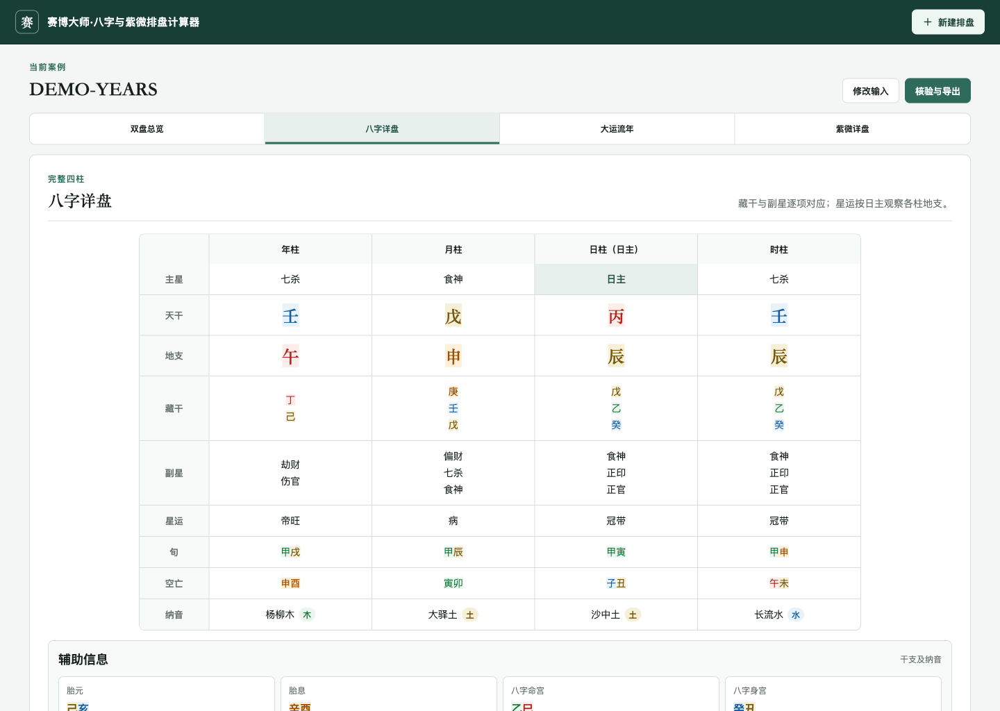
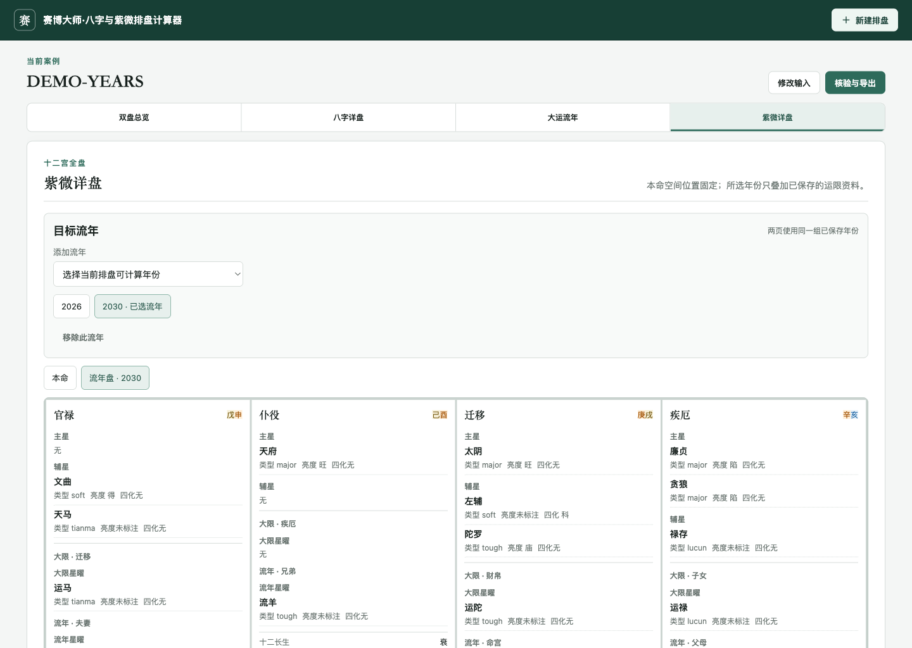
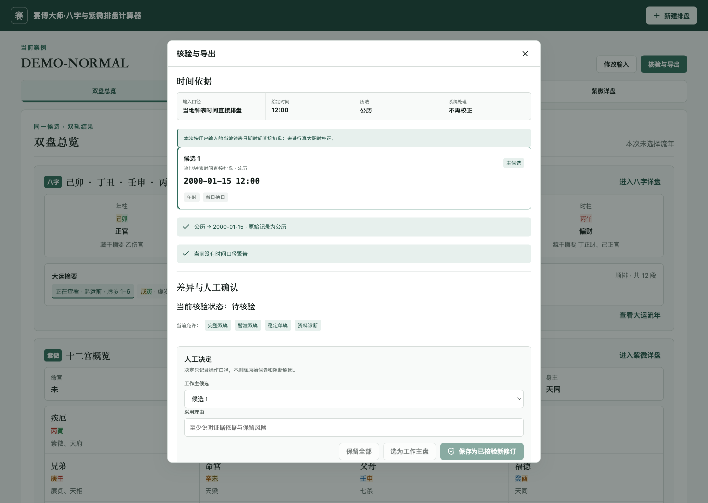

# 赛博大师·八字与紫微排盘计算器

## 项目定位 / English summary

这是一个在用户电脑本地运行的八字与紫微斗数基础排盘计算器。它把资料录入、双盘计算、差异核验、历史修订和脱敏导出放在同一个可追溯流程中；八字与紫微斗数在项目中同等重要。

**English:** A local-first Bazi and Zi Wei Dou Shu calculator for traceable chart calculation, review, revision history, and redacted exports. The first public release is verified on macOS; Windows support is planned.

## 功能与边界

主要功能：

- 根据用户输入生成八字与紫微斗数基础排盘信息；
- 对晚子时、时间口径差异和多个候选结果保留人工核验入口；
- 保存不可覆盖的修订记录，便于复查计算依据；
- 在大运流年与紫微详盘之间共享目标年份；
- 下载默认脱敏的核验资料包，也可明确选择包含私密身份的版本。

本项目只提供计算与核验底稿，不生成吉凶断语，也不提供医疗、法律、财务或其他专业意见。旺衰、格局、用神、合盘、AI 解读、云同步和多人账号不在首个公开版本范围内。

## 合成演示截图

首发演示只使用三个从零构造、与任何真实人物无关的合成案例：普通盘、晚子时双候选、共享流年。以下截图均已通过浏览器与隐私验收，不含真实人物资料。

### 双盘总览



### 八字详盘



### 大运流年与紫微斗数流年联动



### 核验与脱敏导出



## 五分钟开始使用（macOS）

准备条件：安装 **Node.js 24 或更高版本**，并下载或克隆本项目到本机。打开“终端”，进入项目目录后依次运行：

```bash
node --version
npm ci
npm run build
npm start
```

启动成功后，程序会自动在默认浏览器打开本机页面。请保持终端窗口运行；结束使用时，在终端按 `Control-C`。

也可以在完成一次 `npm ci` 后，双击 `scripts/start-local.command`。该启动方式会重新构建网页后再启动程序。

想先看不含真实资料的命令行输出，可运行：

```bash
npm run demo
```

程序只监听本机地址 `127.0.0.1`。案例默认保存在项目的 `data/` 目录；高级用户可以在启动前通过 `CYBER_SAGA_DATA_DIR` 指定其他本机目录。

## 数据与隐私

- 案例数据默认只保存在本机，不会由本程序上传到云端。
- 私密身份与普通计算资料分开保存；默认导出不包含私密身份。
- “导出到下载文件夹”使用浏览器的默认下载位置；“选择保存位置”可让支持该功能的浏览器选择目标位置，不支持时会回退到默认下载。
- 只有用户明确勾选后，导出包才会包含私密身份文件。分享前仍应自行复核文件内容。
- 不要提交或公开 `data/`、数据库、日志、环境变量、导出包、真实案例或含本机信息的截图。
- 禁止在公开 GitHub Issues 中发布真实出生资料、姓名、地点、联系方式、密钥或令牌。

完整规则见 [PRIVACY.md](PRIVACY.md)。

## 测试与非阻塞性能基准

准备贡献或发布候选时，运行正确性发布门：

```bash
npm run test:release
```

该命令会运行公开功能测试、类型检查和正式构建；任何失败都会阻止发布。

性能基准单独运行：

```bash
npm run test:performance
```

性能结果用于发现优化方向，暂不阻塞首发，也不能替代正确性测试。当前内部 `provided-time` 基准未达到既定目标，因此不宣称性能门已经通过；项目不会为了缩短耗时而弱化严格重读、篡改检测或原子保存。

## 平台支持（macOS 已验证，Windows 计划中）

首个公开版本只承诺已验证 macOS。核心代码、`npm start` 和浏览器下载流程提前保持跨平台边界，但 Windows 尚未完成正式验收。

正式宣布支持 Windows 前，还需要补齐 Windows 一键启动方式、自动测试矩阵，并在 Windows Chrome/Edge 中验证中文路径、保存位置、权限和下载行为。

## 贡献、安全、许可证与第三方归属

- 贡献前请阅读 [CONTRIBUTING.md](CONTRIBUTING.md)，公开测试和演示只接受完全合成的数据。
- 安全问题请按 [SECURITY.md](SECURITY.md) 报告；不要在公开 Issue 中附带真实出生资料或漏洞敏感细节。
- 项目采用 [MIT License](LICENSE)。
- GeoNames 数据归属见 [LICENSES/GeoNames-CC-BY-4.0.md](LICENSES/GeoNames-CC-BY-4.0.md)。
- `@4n6h4x0r/stem-branch` 归属见 [LICENSES/stem-branch-Apache-2.0.md](LICENSES/stem-branch-Apache-2.0.md)。
- 版本变化见 [CHANGELOG.md](CHANGELOG.md)。
